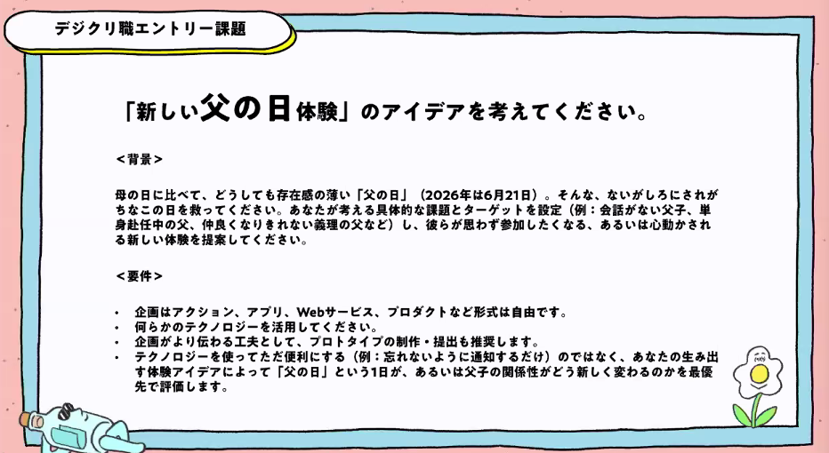
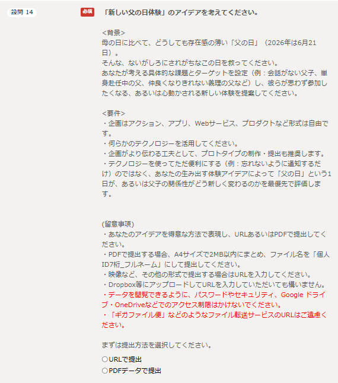

# Dentsu Lab Tokyo
デジタルクリエイティブ職選考前セミナー
# セクション1:デジタルクリエイティブ職セミナー
- 担当
	- オオタキさん
- 本編
	- テーマ
	    - 本日のテーマ
	    - まだこの世界にない「新しい体験」を発明する
	        - 広告だけじゃない、デジタルクリエイティブの仕事
	- 自己紹介
		- 大瀧篤
		- 目の前の人に全力を尽くす
		- どんなチームか
	    - 電子工作をやっている人もいれば、撮影をやっている人もいるようなチーム
	    - 人数がどんどん増えている（※以下の数字は古いが、特徴は以下の通り）
		    - Creative Director：3名
		    - Copy+Planner：10名
		    - Creative Technologist：22名(入社後はこのポジションにつくことが多い)
		    - Art Director：8名
		    - Producer：5名
	- 電通ラボとは
	     - 電通とはコミュニケーションを作る会社
	     - R＆Dをやることもある
	     - 大切にしていること：Playful,「おもいもよらない」
		 - Dentsu Labとしてグローバルに展開
		 - Field（活動領域）：テクノロジーをとり入れた新しい体験づくり
			 - 新しい施設をつくる
			 - 新しいショーウインドウインスタレーション
			 - 新しいスポーツ、楽器をつくる
			 - 新しいドラマ、MV、ライブ演出、ステージ演出
			 - 新しいツール/サービス/プラットフォームをつくる
				 - アプリ、キャンペーン、映像 etc.
			 - →と、無限に広がっている。「次は何をしよう？」と常々企んでいる。
		 - 電通ラボ(クリエイティブ職)の良いところ
			 - 新しい「血」であり「筆」である。
			 - 圧倒的なキャリアの多様性。
			 - 広告以外も含めた全てがフィールド。
			 - 表現が国境を超える。
			 - 「作り方を作る。」という発想で仕事ができる。
			 - 若くしてリーダーとして活躍できる。
			 - 得意技 x テクノロジーで、得意技を拡張できる。
			 - オーダーメイドなモノづくりができる。
			 - 消えずに「残る」モノづくり。
			 - 人の心と向き合う仕事である以上、人間が好きな人は向いている。
		- わるいところ
			- 「よくもわるくも、最新テクノロジーが魅力的であること。」
			- 手段に溺れないようにしたい。
			- →目的達成のための強い武器であることを認識して、社会や困っている人のソリューションのために使っていく。
			- 人の心を動かすようなコトバ、デザインとの組み合わせ。
		- 学生時代はJaxaと共同研究したり、AIと教育の観点で論文を発表したりしていた。
		- 電通ラボの書籍：クリ活
		- 広告クリエイターの本質は、人の心を動かすこと。
		- 最も効くアプローチを。広告じゃなくてよい。
			- ロボット、AI、ウェアラブル、スポーツ、VR、エコシステム、、
			  × イベント、映像、PR、キャンペーン、、
		- ＜どう旗を立てるか＞（大瀧さんの場合）
			- 過去の経験と自分の好きなことから抽出。
			- 大学院でAIを研究。ロボット/ロケットや衛星開発とか「テクノロジー」が好きだった。
			- プロモーション局でイベント/PRの知見あり。お金面含め実施力がついた。
			- 入社4年目までの経験の中で「クリエイティブ」が好きだと確信。転局試験に向けて猛勉強を始める。
			- →当時はまだまだ旗を立てている人が少なかった、「テクノロジー×イベント×クリエイティブ」の領域に旗を立てよう！と決定。
			- ゆるスポーツにも出会い、みんなと違う山を登り始めた。
	- 仕事紹介
		- 事例紹介：「TON-Ton VOICE SUMO」
			- プレイヤーの「トン」という声と連携してトントン相撲を行う
			- 声を出さなくなり、のどの筋肉が衰えお餅がのどにつっかえてしまうという事例がある。
			  この課題に対して、高齢者が声を出せるものを作りたいというのが原体験
			- 介護用だけではなく、「バキ道」とコラボした商品も開発。
			- 天井に風背を飛ばし花火を見えるようにするものも開発：これは肩のリハビリになる。
	- メッセージ
		- 表現面のクラフトにこだわることは大前提
		- 量やサイズに関わらず、顧客体験を考えるために大切なこと
			- たった一人のために。自分の家族のために。自分のライフワークのために。
			- そういった本来はマスと真反対な小さなアウトプットを大切に。
			- それが、熱量を帯びたアウトプットを産むことになったりする。
		- 小さく試して、大きな舞台に持ち込む
			- 小さく試す方法としては、ゆるスポーツや、Dentsu Lab TokyoでのR&D等。
			- 課外活動で物作りをしたりでもOK。
			- 大事なことは、それをどう育てて続けていくのか。
			- その知見が、大きな舞台でも活きていくと信じている。
			- 小さな実験は、大学でもできるかもしれない。しかし、電通には大きな舞台にも挑戦できる環境がある。
		- デジタルクリエイティブとは、目的達成のためには手段を選ばない。総合格闘技のようなもの
		- 理系じゃなくても、知識があるだけでAIを活用したらいいプロダクトは作成できる。
		- No1もいいけど、ユニークな存在になろう。
			- ドラクエのパーティーを組む感じで、仕事はスタートする。
			- このダンジョンに挑むなら、このCW、AD、PL、Prがいいなぁ・・とCDが招集する。（営業ならどのCRとストプラと・・という感じで同様）
			- よばれる側であるうちは、自分の上位互換の人がいたらパーティーに入れない。
			- ただし、そもそも比較がない能力を持っていれば、向かうダンジョン次第で入る余地が生まれる。
			- 必要な能力だからまだ弱くても育てよう！となる。よばれて実践を積むとレベルアップする。若くして独自知見と技が増える。次第にレギュラーメンバーになる。
			- ユニークな存在になるので別のパーティーからもよばれる。その繰り返し。
			- 今の時代だからこそ必要な武器を手に入れよう。自分にとってデジタルクリエイティブがそうでした。
		- あなたのスキル×テクノロジーが一番輝くことのできる山かもしれない。
		- あなたのスキル×デジタルクリエイティブ職の組み合わせもいいかもしれない！
		- 世界の景色が多様になる、幸せな仕事。
			- この仕事は幸せな仕事だと常々思っている。
			- クライアントの商品や世の中に光を当てる仕事だから。
			- 嫌なところを探して指摘して終わりな仕事ではない。
			- 一番輝けるであろうポテンシャルを探り出し、そこを全力でクライアントさんと一緒に伸ばしたり、全力でピカピカに磨く仕事。
			- 自然と、人の良いところを見つけることが得意になる。街の見え方も変わってくる。
			- 日本のことだって、世界の見え方だってそう。
			- 新入社員のころより確実に世界を味わえる人間になっています。
			- あなたもきっと、世界中のポテンシャルに気づく楽しい人生になると思います。
	- まとめ
		- ◆デジタルクリエイティブとは？
			- →その時代の新しい「体験」を発明すること。広告に限らない。
		- ◆領域
			- →XR、AI、ロボット、プロダクト、スポーツ、展示会、MV、・・・無限に広がっている。
		- ◆良いこと
			- →マーケ、事業、経営いくらでも領域を超える。言語の壁を超える。

# セクション2:デジタルクリエイティブ職座談会
- どんな仕事をしているのか
	- ナカヤマさん
		- まだこの世に生まれてないものを生み出す仕事
		-クライアントも生まれてない商品を想像するのが難しいので、提案の時にはモックも作成していく。
	- クキさん
		- 新しい体験を生み出す仕事
	- ササキさん
		- 新人のうちは研修が多め 
- どうすればアイディアを生み出せるか
	- ナカヤマさん
		- 発見のストックからお題にフィットするものを組み合わせる。
		- クライアントの課題周辺の情報を組み合わせて、新しいものを提案する。
	- クキさん
		- 布団の中で
		- 寝る前にアイディアを考えて、朝起きてから確認する。
	- ササキさん
		- お風呂で、散歩で
		- 足の裏に刺激を入れると、アイディアが思いつく。

- どんな人と仕事したい？どんなキャリアを作る？
	- ナカヤマさん
		- 火星でも暮らせる人と仕事がしたい。酸素がない！ではなく酸素作ってみよう！と考えてくれるような乗り気な人。
		- キャリア観は入社10年目。表現の仕方をどんどん学んでいるフェーズ
	- クキさん
		- なんでも楽しんでくれること
		- キャリア観は悩んでいる。原因は、AI
	- ササキさん
		- キャリア観はデザインコンペに挑戦し、チャレンジの幅を広げている。

---

